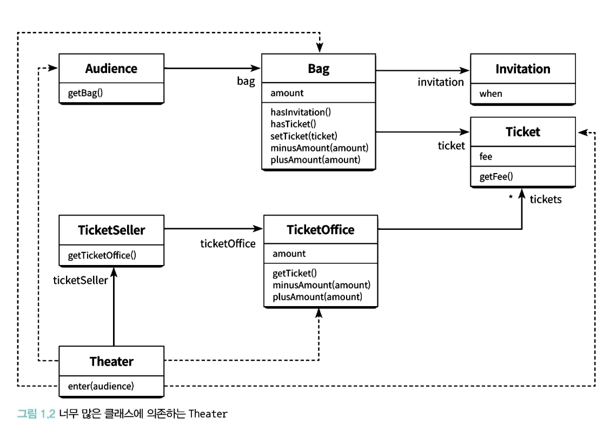

## 패러다임의 유래.

- 모델, 패턴 또는 전형적인 예를 의미하는 그리스어 파라데이그마(paradeigma)에서 유래.
- 예를 들면 동사의 활용으로 그는/그녀는/그것은 사랑한다.는 라틴어로 각각 amo,amas,amat으로 표현한다.

현대의 패러다임은 '한 시대의 사회 전체가 공유하는 이론이나 방법, 체계'를 의미한다. 왜 바뀌게 된걸까?

- 1962년 토마스 쿤의 "과학혁명의 구조" 책 출간으로 시작.
- 과학의 발전이란?
  before : 이미 달성한 과학적 성취를 누적하며 진보
  after : 과학은 단순한 계단식이 아닌 기존의 견해를 붕괴시키는 혁명적 과정에서 발전 주장.

과학혁명이란 과거의 패러다임이 새로운 패러다임에 의해 대체됨으로써 정상과학의 방향과 성격이 변하는 것을 의미. 이를 패러다임 전환이라고 부른다.
하나의 예시로 천동설 => 지동설 도 있다.

### 프로그래밍 패러다임

- 패러다임이라는 용어의 선택의 장점은. 법칙, 이론, 응용, 도구의 조작 등 모두를 포함한 실제로 인정된 실례들, 정통 모델을 사용한다는 것을 의미.
- 공유된 패러다임에 근거하여 동일한 규칙과 표준에 헌신
- 즉 불필요한 의견 충돌을 방지한다.

- 프로그래밍에서는 절차형, 객체지향 두 패러다임이 함께 공존할 수 있다. 서로의 장단점을 보완하는 경향이 있고 대표적으로 두 패러다임을 접목시킨 스칼라가 있다.

- 오브젝트의 저자는 프로그래밍 패러다임은 과학과 달리 혁명적이기보다 발전적이라고 말한다. 그래서 여러 패러다임을 알고 넓은 시야를 가져야한다.

## 티켓 판매 애플리케이션 구현하기

초기 설계의 문제점.
1장 객체설계/src/models/Theater.ts은 소극장을 구현한 것이다. 설명은 코드 밑에서 진행하겠다.

```
enter(audience: Audience): string[] {
    const log: string[] = [];
    const name = audience.getName();

    if (audience.getBag().hasInvitation()) {
      log.push(
        `<span class="chain">audience.getBag().hasInvitation()</span> → 초대장 확인됨`,
      );

      const ticket = this.ticketSeller.getTicketOffice().getTicket();
      log.push(
        `<span class="chain">ticketSeller.getTicketOffice().getTicket()</span> → 티켓 꺼냄`,
      );

      if (ticket) {
        audience.getBag().setTicket(ticket);
        log.push(
          `<span class="chain">audience.getBag().setTicket(ticket)</span> → 티켓을 가방에 넣음`,
        );
        log.push(
          `<strong>${name}</strong>이(가) 초대장으로 무료 입장했습니다.`,
        );
      }
    } else {
      log.push(
        `<span class="chain">audience.getBag().hasInvitation()</span> → 초대장 없음`,
      );

      const ticket = this.ticketSeller.getTicketOffice().getTicket();
      log.push(
        `<span class="chain">ticketSeller.getTicketOffice().getTicket()</span> → 티켓 꺼냄`,
      );

      if (ticket) {
        const fee = ticket.getFee();

        audience.getBag().minusAmount(fee);
        log.push(
          `<span class="chain">audience.getBag().minusAmount(${fee})</span> → 관객 가방에서 ${fee.toLocaleString()}원 차감`,
        );

        this.ticketSeller.getTicketOffice().plusAmount(fee);
        log.push(
          `<span class="chain">ticketSeller.getTicketOffice().plusAmount(${fee})</span> → 매표소에 ${fee.toLocaleString()}원 추가`,
        );

        audience.getBag().setTicket(ticket);
        log.push(
          `<span class="chain">audience.getBag().setTicket(ticket)</span> → 티켓을 가방에 넣음`,
        );

        log.push(
          `<strong>${name}</strong>이(가) ${fee.toLocaleString()}원을 지불하고 입장했습니다.`,
        );
      }
    }

    return log;
  }
```

### 위의 코드는 뭐가 이상할까?

로버트 마틴은 소프트웨어 모듈이 가져야 하는 세 가지 기능에 관해 설명한다. 여기서 모듈이란 크기와 상관 없이 **클래스나 패키지, 라이브러리와 같이 프로그램을 구성하는 임의의 요소**를 의미
(클린 소프트웨어: 애자일 원칙과 패턴, 그리고 실천 방법 책에서 말함.)

소프트웨어 모듈의 세가지 목적

1. 실행 중에 제대로 동작해야한다.
2. 변경을 위해 존재하는 것이다.
3. 코드를 읽는 사람과 의사소통하는 것이다. - 모듈은 특별한 훈련 없이도 개발자가 쉽게 읽고 이해할 수 있어야 한다.

**코드를 해석해보자.**

- 소극장은 관람객의 가방을 열어 그 안에 초대장이 들어 있는지 살펴본다. 가방 안에 초대장이 들어 있으면 판매원은 매표소에 보관돼 있는 티켓을 관람객의 가방 안으로 옮긴다. 가방 안에 초대장이 들어 있지 않다면 관람객의 가방에서 티켓 금액만큼의 현금을 꺼내 매표소에 적립한 후에 매표소에 보관돼 있는 티켓을 관람객의 가방 안으로 옮긴다.

문제를 한줄로 정의하자면 "관람객과 판매원이 극장의 통제를 받는 수동적인 존재"

문제

1. 관람객의 입장에서 소극장이라는 제3자가 초대장을 확인하기 위해 관람객의 가방을 마음대로 열어본다면 멍하니 바라 볼 것인가?
2. 판매원이라도 문제이다. 소극장이 허락도 없이 보관중인 티켓과 현금을 마음대로 접근하기 때문, 티켓을 꺼내 관람객의 가방에 무작정 집어넣고 받은 돈을 매표소에 적립하는 일을 판매원이 아닌 소극장이 한다는 점.

이해 가능한 코드란 그 동작이 우리의 예상에서 크게 벗어나지 않는 코드이다.

- 위의 설명만 봐도 이미 예상을 벗어남.

변경 취약성도 존재

- 판매원이 매표소에서만 티켓을 판매한다는 가정이 존재.
- 관람객이 가방이 없다면?
- 신용카드 결제라면?
- 판매원이 매표소 밖에서 티켓을 판매한다면?

의존성 문제.

- Audience에서 가방을 제거한다면? Audience의 가방에 직접 접근하는 Theater의 enter메서드 역시 수정해야함.
- 등등..

그러나 의존성 제거가 답은 아닌 불필요한 의존성만 제거하는 것이 목적

객체 사이의 의존성이 과한 경우 결합도가 높다고한다.



### 설계를 개선해보자

Theater 직접 접근-> Audience, TicketSeller : 결합된다는 것을 의미
Audience, TicketSeller를 변경하면 Theater도 변경해야한다.

**해결 방법.**

- 관람객이 가방을 가지고 있다는 사실
- 판매원이 매표소에 티켓을 판매한다는 사실
  이 두가지를 극장이 알필요는 없다.

### 자율성을 높이자

1. Theater에서 TicketOffice로 접근하는 코드를 TicketSeller내부로 옮겨서 티켓 판매원이 티켓 판매소를 거치도록하자. -> Theater는 TicketSeller에게 판매를 위임한다.
   [커밋 참고](https://github.com/jxxh204/Object-Study/commit/d8f8627de104baa42a0b7390afb323f4cd607981)

- TicketSeller의 getTicketOffice 메서드가 제거되었다. ticketOffice의 가시성은 private이고 접근 가능한 퍼블릭 메서드가 더 이상 없기 떄문에 외부에서 ticketOffice에 직접 접근은 불가하다. 결과적으로 ticketOffice의 TicketSeller안에서만 존재한다.
  -> 이처럼 개념적이나 물리적으로 객체 내부의 세부적인 사항을 감추는 것을 캡슐화라고 부른다.

2. TicketSeller 다음으로 Audience의 캡슐화를 개선.

- Audience에 buy를 추가하고 구매로직을 가방에서 티켓을 꺼내는 로직을 적용하자.

[커밋 참고](https://github.com/jxxh204/Object-Study/commit/d8f8627de104baa42a0b7390afb323f4cd607981)

### 개선된 점

- 기능은 이전과 동일하지만 달라진 점은 Audience와 TicketSeller는 자신이 가지고 있는 소지품을 스스로 관리한다. (우리의 예상과 일치.)
- Audience, TicketSeller의 내부 구현을 변경하더라도 Theater를 함께 변경할 필요가 없어졌다.

### 어떻게 개선했는가.

- TicketOffice의 모든 부분을 TicketSeller내부로 이동
- 티켓구매를 위해 가방을 뒤지는 행위를 Audience내부로 이동
- 자기 자신의 문제를 스스로 해결하도록 변경

### 핵심

- 객체 내부의 상태를 캡슐화하고 객체 간에 오직 메시지를 통해서만 상호작용하도록 만든것.
- Theater는 TicketSeller의 내부를 모른다. 다만 icketSeller 가 sellTo 메시지를 이해하고 응답할 수 있다는 사실만 알고있음.
- 밀접하게 연관된 작업만 수행하고 연관성 없는 작업은 다른 객체에게 위임하는 것을 **응집도**가 높다고 한다.
- 응집도가 높기위해서는 객체가 자신의 데이터를 책임져야한다.

### 절차지향, 객체지향
